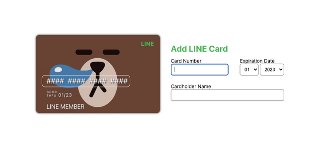

# Card Form UI

I was inspired by [Viki's Credit Card Animation](https://codepen.io/viki-code/pen/QWYYJBQ) and attempted to create my own version of a card form. I borrowed the design from LINE card.

## Video

Check out the implementation video on YouTube: [インタラクティブなLINEカードフォーム：HTML/CSS/JavaScript](https://www.youtube.com/watch?v=HqAw3SyaepA)
